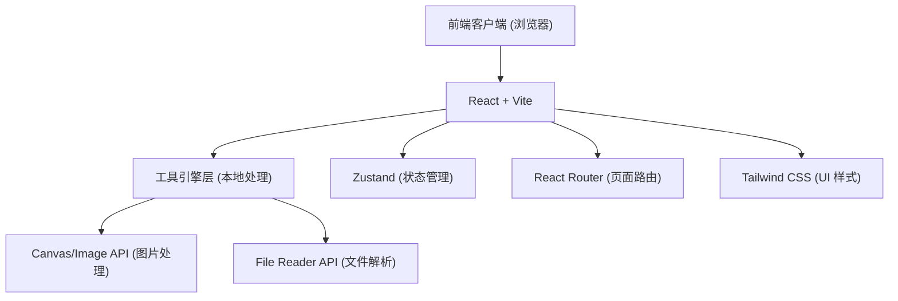

## 1. 架构设计



## 2. 技术说明
- **前端框架**: React@18
- **构建工具**: Vite
- **样式方案**: Tailwind CSS@3
- **图标库**: Lucide React
- **状态管理**: Zustand (用于全局主题切换、近期使用工具记录等)
- **路由**: React Router v6
- **核心逻辑**: 尽可能使用浏览器原生 API（如 Canvas 转换图片）进行本地计算，无需后端服务。

## 3. 路由定义
| 路由 | 目的 |
|-------|---------|
| `/` | 工具箱首页，展示所有可用工具卡片。 |
| `/recent` | “近期使用”工具列表页。 |
| `/popular` | “热门推荐”工具列表页。 |
| `/cat/:category` | 按照特定类别筛选的工具列表页。 |
| `/tools/image-converter` | 图片格式转换工具页，支持拖拽和参数调节。 |
| `/tools/document-converter` | 文档格式转换页 (概念展示/Mock 页面)。 |
| `/tools/json-to-excel` | JSON 转 Excel 工具页。 |
| `/tools/excel-to-json` | Excel 转 JSON 工具页。 |
| `/tools/timestamp-converter` | Unix 时间戳双向转换工具。 |
| `/tools/claude-commands` | Claude CLI 终端命令行工具速查手册。 |
| `/about` | 介绍和隐私说明页。 |

## 4. API 定义 (预留)
本项目目前设计为纯前端（客户端本地）处理，所有转换逻辑在浏览器内存中完成，无后端交互。
这不仅保证了极快的使用体验，还从根本上解决了用户对于文件隐私的担忧。

## 5. 服务器架构图 (可选，目前为静态部署)
由于无后端依赖，本项目可以非常方便地打包并部署至任意静态页面托管服务，如 GitHub Pages, Vercel, Netlify 或自建 Nginx。

## 6. 数据模型 (前端状态)
使用本地配置管理工具列表，并在 localStorage 中记录用户的使用偏好。

### 6.1 工具数据结构 (静态配置)
```typescript
interface ToolInfo {
  id: string;
  name: string;
  description: string;
  category: 'image' | 'document' | 'developer' | 'text';
  icon: string; // 对应 Lucide 图标名称
  path: string; // 路由路径
  isPopular?: boolean;
}
```

### 6.2 用户偏好状态 (Zustand Store)
```typescript
interface AppState {
  theme: 'light' | 'dark' | 'system';
  recentTools: string[]; // 最近使用过的工具 ID 列表
  addRecentTool: (id: string) => void;
  setTheme: (theme: 'light' | 'dark' | 'system') => void;
}
```
