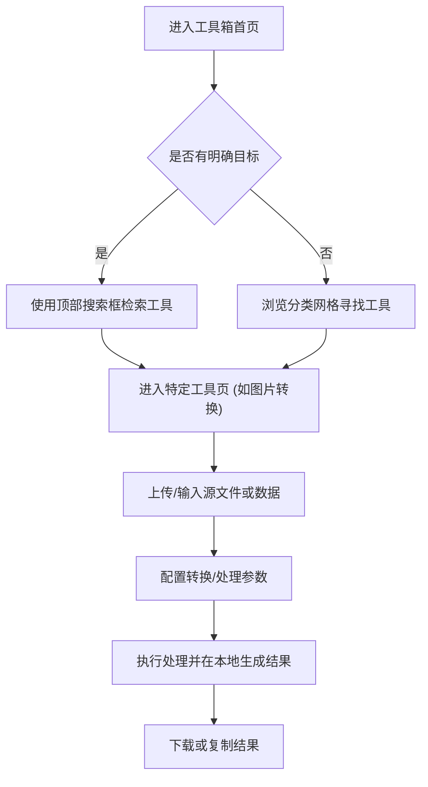

## 1. 产品概述
本项目旨在开发一款个人在线工具箱网站（Personal Utility Tools）。
- 网站聚合了开发者/普通用户日常高频使用的工具，如图片格式转换、文档格式转换、代码格式化、Base64 编解码等。
- 目标是提供一个纯净、高效、即用即走的工具平台，界面设计倾向于极简、现代化和实用主义，提升用户的工作效率。

## 2. 核心功能

### 2.1 页面模块
1. **首页 (Dashboard/Home)**：展示所有可用工具的卡片网格导航，包含搜索框以便快速定位工具。
2. **工具详情页 (Tool Interface)**：每个工具独立的工作区。例如图片转换区、文档转换区等。
3. **关于页面 (About)**：简单介绍网站用途和隐私声明（如所有处理均在本地浏览器完成，不上传服务器）。

### 2.2 页面详细描述
| 页面名称 | 模块名称 | 功能描述 |
|-----------|-------------|---------------------|
| 首页 | 侧边栏/顶导 | 提供全局导航、暗/亮色模式切换、全局搜索功能。 |
| 首页 | 工具分类网格 | 按分类（图片、文档、开发、文本、AI工具）展示工具卡片，点击进入对应工具页。 |
| 近期使用 | 工具展示网格 | 展示用户最近访问过的工具列表，按照访问时间倒序排列。数据保存在本地浏览器中。 |
| 推荐工具 | 工具展示网格 | 展示系统中被标记为 `isPopular` 的热门/推荐工具列表。 |
| 图片转换页 | 拖拽上传区 | 支持用户拖拽图片文件到指定区域，或点击选择文件。 |
| 图片转换页 | 参数配置区 | 选择目标格式（PNG, JPG, WEBP 等）、压缩质量调节。 |
| 图片转换页 | 预览与下载 | 转换完成后提供结果预览和下载按钮。 |
| JSON 转 Excel 页 | 拖拽上传区 | 支持用户拖拽 JSON 文件到指定区域，或直接粘贴 JSON 数据。 |
| JSON 转 Excel 页 | 预览与下载 | 解析后预览表格数据，并提供下载 Excel 文件功能。 |
| Excel 转 JSON 页 | 拖拽上传区 | 支持用户拖拽 Excel 文件到指定区域。 |
| Excel 转 JSON 页 | 预览与下载 | 解析后预览 JSON 数据，并提供下载 JSON 文件功能。 |
| 时间戳转换页 | 交互查询区 | 支持在 Unix 时间戳和自然时间格式（如 YYYY-MM-DD HH:mm:ss）之间双向转换，提供当前时间的快捷输入与复制功能。 |
| Claude 命令查询 | 查询交互区 | 提供搜索框供用户输入想要查询的 CLI 终端命令，通过本地数据检索匹配的常用 Claude (或通用) 命令行指令、参数及说明。 |
| 文档转换页 | 占位区 | （Mock功能）提供类似界面，示意文档格式转换流程。 |

## 3. 核心流程
用户寻找工具并使用的流程。

## 4. UI设计与交互
### 4.1 设计风格
- **主色调**：浅色模式以干净的白色和浅灰为主，暗色模式以深灰和纯黑为主。强调工具的专业感和界面的清晰度（参考 Vercel, Linear 等极简现代设计）。
- **排版**：使用清晰的系统字体（如 Inter, Roboto, San Francisco）。层级分明，拒绝过度修饰。
- **组件样式**：卡片式布局，带有微弱的阴影和细边框，悬停时轻微上浮或边框颜色高亮。
- **交互动画**：页面切换平滑过渡，拖拽上传区域在文件拖入时有明显的虚线框反馈和背景色变化。

### 4.2 页面设计概览
| 页面名称 | 模块名称 | UI 元素与视觉表现 |
|-----------|-------------|-------------|
| 首页 | 搜索框 | 大尺寸、居中、带快捷键提示 (如 Cmd+K) |
| 首页 | 工具卡片 | 包含工具图标（Lucide）、标题、简短描述，Hover态浮现 |
| 工具页 | 工作区 | 极简表单，巨大的虚线拖拽区域，清晰的进度指示器 |

### 4.3 响应式设计
- 桌面端：左侧边栏导航 + 右侧主内容区，或顶部导航 + 居中网格。
- 移动端：侧边栏折叠为底部导航或汉堡菜单，工具工作区堆叠显示，方便手指点击。
